# Workshop Xamarin + .net Core - Microsoft Build 2019


Repositório sobre o evento Microsoft Build 2019, localmente em Belo Horizonte em 21/05/2019

# Organizadores

- Albert Tanure - [🔎](https://linkedin.con/in/albert-tanure) 
- Carlos Henrique - [🔎](https://www.linkedin.com/in/carlos-henrique-rocha-gabriel-0ba31328?lipi=urn%3Ali%3Apage%3Ad_flagship3_notifications%3By4GFbscJTymJu2DhFXXrsw%3D%3D) 


# Pré-requisitos

- .net core 2.2
- Visual Studio Code e/ou Visual Studio (Windows/MAC)
- Xamarin (instalado juntamente com o Visual Studio)

# Conteúdo

- **Aplicação .Net Core** - Aplicação desenvolvida utilizando a plataforma .Net Core com o objetivo de fornecer informações para o App Mobile via protocolo REST.

- **Aplicação Mobile** -  Aplicações mobile desenvolvida em Xamarin.Forms, para as plataformas Android e IOS, consumido as APIS disponíveis na aplicação .net core.

# Arquitetura proposta

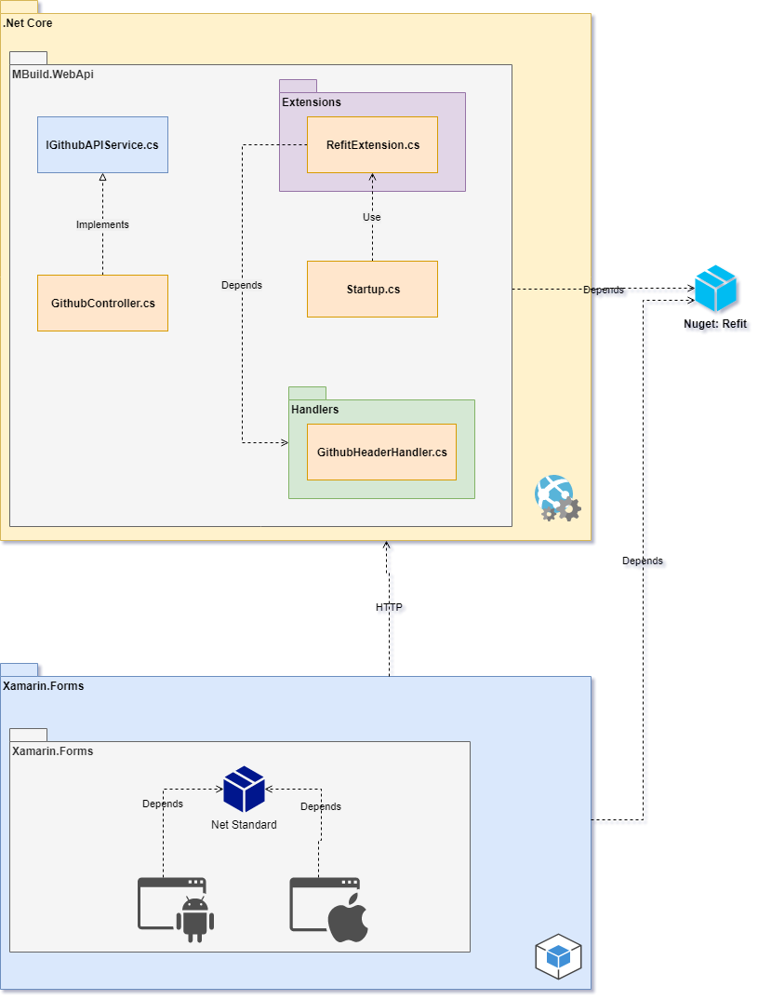

# Criação do projeto

Para criar o projeto, abra o Visual Studio, estou utilizando a versão 2019 e clique **Create New Project**.

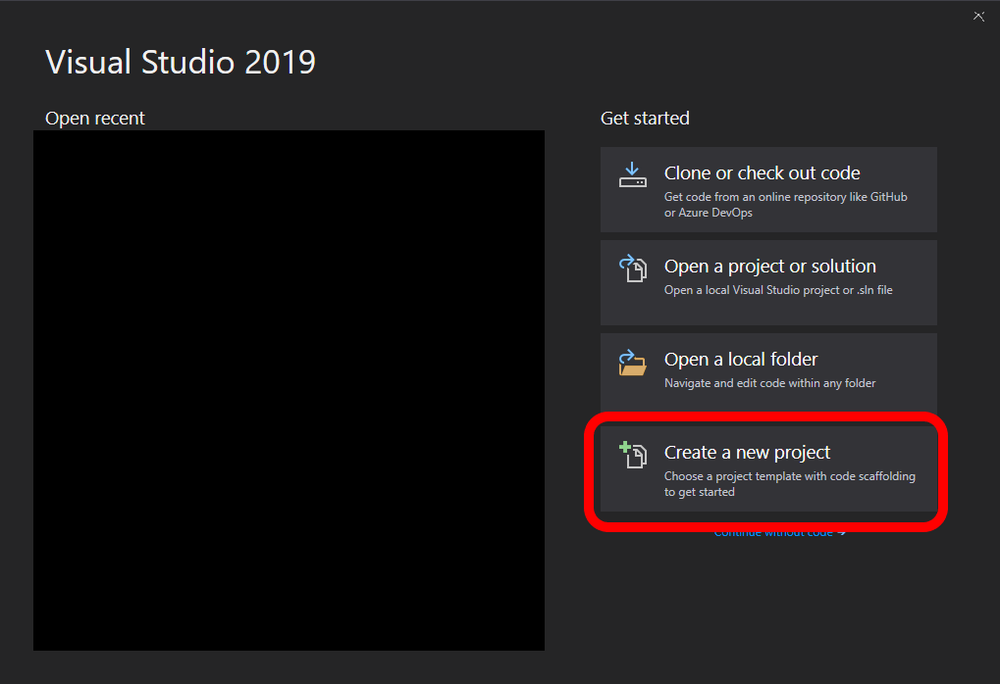

Em seguida, selecione a opção ASP .net Web Application e clique em next.

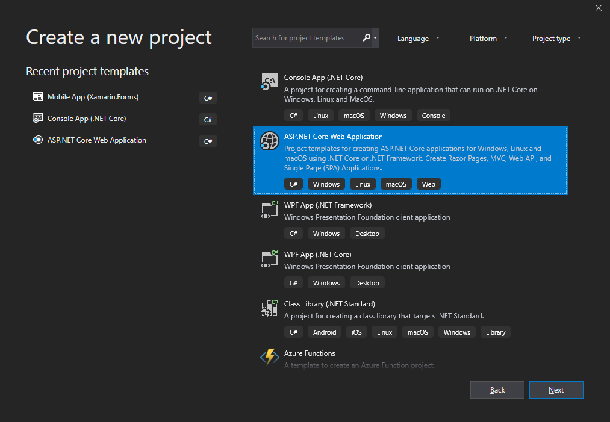


Configure os parâmetros do projeto de acordo com os campos, como nome do projet, solution e caminho onde o mesmo será criado. Em seguida, clique em Create.

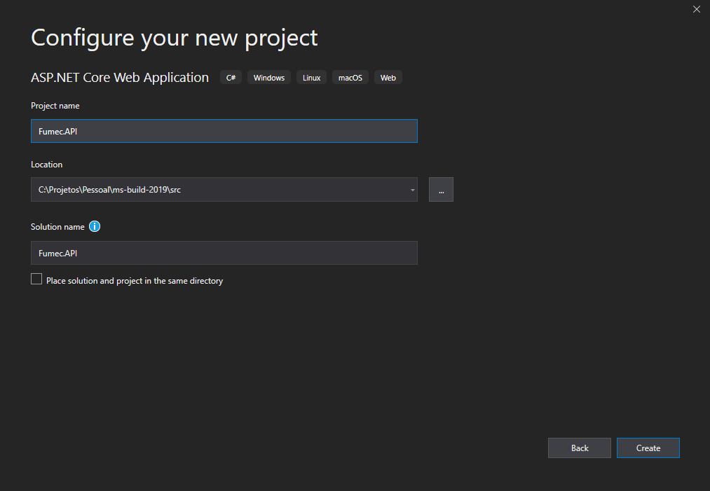

Utilizei os seguintes parâmetros:
- **Project Name** - Fumec.API
- **Location** - Path
- **Solution Name** - Fluent.API

Na tela seguinte, selecione **API**, desmarque checkbox **Configure for HTTPS**. Deixe as opções padrão nos combos para .Net Core e Asp.Net Core 2.2 (versão instalada em meu computador). Clique em Create.

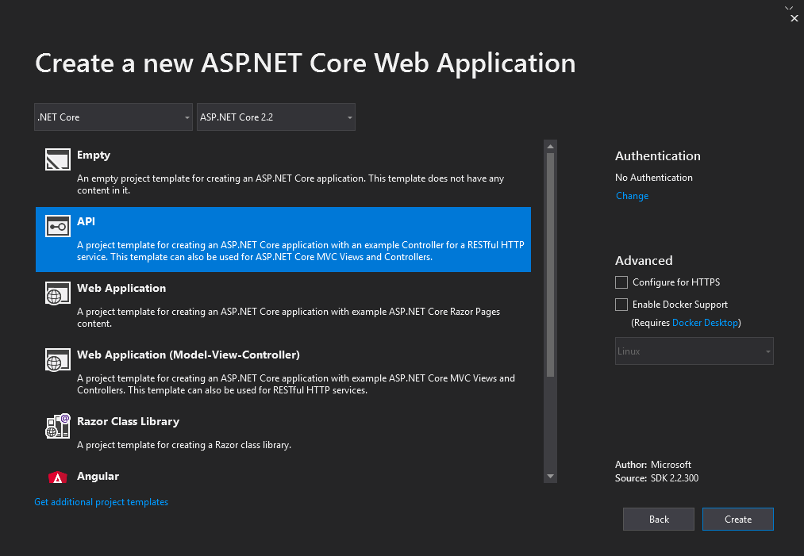

Abaixo a solution do projeto:

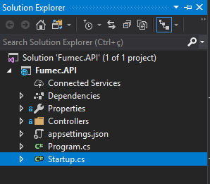

# Detalhes da aplicação .Net core

O projeto criado para servir de base da API possui alguma implementação como exemplo de uso. No entando, devemos adequar o projeto atender a demanda do aplicativo mobile quei vamos desenvolver.

Para isso, seguindo a arquitetura proposta, devemos adicionar um pacote Nuget para abstrair o consumo de serviços REST. Utilizaremos a library REFIT. É uma implementação baseada no projeto para o "mundo" Android, denominada Retrofit. Para maiores detalhes sobre o Refit, consulte a [documentação](https://github.com/reactiveui/refit).

## Adicionando o pacote Nuget Refit

- Para adicionar o pacote nuget, na solution explorer, clique com o botão direito do mouse sobre **Dependencies**.
- Selecione a opção **Manage nuget packages...**.
- Clique em **Browse** e na caixa de texto, escreva **Refit**.
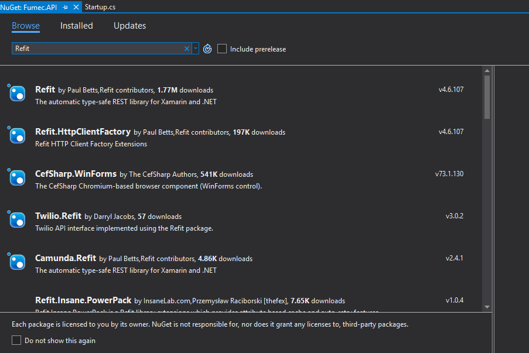
- Selecione a primeira opção, **Refit**, e clique em Install.
- Adicione também o pacote **Refit.HttpClientFactory**.

## Arquivos do projeto

Alguns arquivos serão criados ou excluídos do projeto.

- Na pasta **Controller**, exclua o arquivo **ValuesController**

- Clique com o botão direito do mouse no projeto, em seguida em **Add -> New Folder**.
- Nomeie a nova pasta como **Handlers**
- Crie mais duas pastas novas no projeto, conforme os passos acima, denominadas **Services** e **Extensions**.

Agora, com a estrutura de pastas já definidas, criaremos alguns arquivos. Para adicoinar novas classes, basta selecionar a pasta desejada, clicar com o botão direito do mouse e em seguira **Add -> Class...**. 

Abaixo a relação de pasta/classe a ser criada com seu respectivo conteúdo

- Handlers/GitHeaderHandler.cs 

``` csharp

using System.Net.Http;
using System.Threading;
using System.Threading.Tasks;

namespace Fumec.API.Handlers
{
    public class GitHeadersHandler : DelegatingHandler
    {
        private const string HEADER_ACCEPT_NAME = "Accept";
        private const string HEADER_ACCEPT_VALUE = "application/vnd.github.v3+json";
        private const string HEADER_USER_AGENT_NAME = "User-Agent";
        private const string HEADER_USER_AGENT_VALUE = "NOME_DO_SEU_USUARIO_GIT";

        public GitHeadersHandler()
        {
        }

        protected override Task<HttpResponseMessage> SendAsync(HttpRequestMessage request, CancellationToken cancellationToken)
        {
            request.Headers.Add(HEADER_ACCEPT_NAME, HEADER_ACCEPT_VALUE);
            request.Headers.Add(HEADER_USER_AGENT_NAME, HEADER_USER_AGENT_VALUE);

            return base.SendAsync(request, cancellationToken);
        }
    }
}

```

Esta classe tem como objetivo adicionar no cabeçalho das requisições feitas à API do Github, caso contrário não será possível consumir os recursos. O código acima possui uma herança de **HttpClientHandler**, onde sobrescrevemos o método **SendAsync** para adicionar os valores solicitados no git ao cabeçãlho da requisição.

Na constante **HEADER_USER_AGENT_VALUE** adicione o nome do seu usuário do github.

- Services/IGithubAPIService.cs

``` csharp

using Refit;
using System.Collections.Generic;
using System.Threading.Tasks;

namespace Fumec.API.Services
{
    public interface IGithubAPIService
    {
        [Get("/users/{user}/repos")]
        Task<List<object>> GetRepositories(string user);
    }
}


```

Esta interface representa o nosso serviço. Como estamos utilizando a biblioteca do Refit, apenas anotamos o método **GetRepositories** com um atributo denominado **Get**. Com isso, será feita uma requisição utilizando o verbo **GET** para o sufixo **/users/{user}/repos**. O parâmetro **{user}** será substituído pelo parâmetro passado ao método.

Por hora, apenas configure a interface da maneira descrita acima e posteriormente entenderemos como será feita a requisição.

- Extensions/RefitExtension.cs

``` csharp

using Fumec.API.Handlers;
using Fumec.API.Services;
using Microsoft.Extensions.DependencyInjection;
using Refit;
using System;

namespace Fumec.API.Extensions
{
    public static class RefitExtension
    {
        public static void AddRefit(this IServiceCollection services)
        {
            services.AddSingleton(new GitHeadersHandler());

            services.AddRefitClient<IGithubAPIService>()
                .AddHttpMessageHandler<GitHeadersHandler>()
                .ConfigureHttpClient(c =>
                {
                    c.BaseAddress = new Uri("https://api.github.com");

                });
        }
    }
}


```

A classe acima, estática, apenas cria um método de extensão. Esta é uma boa prática no desenvolvimento em .Net Core. Desta forma, delegamos a este método de extensão a responsabilidade de adicionar os serviços relacionados ao Refit ao "motor de injeção de dependência" do .Net Core.

O método **AddRefitClient** possui implementa o pattern **factory** de forma que abstrai um HttpClient em relação a interface **IGithubAPIService**, já associado às requisições o Handler criado anteriormente e configurando o endereço base da API para **https://api.github.com**. Ao utilizar o serviço, será feita uma requisição do tipo GET, para o método **GetRepositories**, para o endereço especificado, concatenando o sufixo determinado no método, na interfaces GithubApiService.

- Controller/GithubController.cs

``` csharp

using Fumec.API.Services;
using Microsoft.AspNetCore.Mvc;
using System.Threading.Tasks;

namespace Fumec.API.Controllers
{
    [Route("api/[controller]")]
    [ApiController]
    public class GithubController : ControllerBase
    {
        private readonly IGithubAPIService _service;

        public GithubController(IGithubAPIService service)
        {
            _service = service;
        }

        [HttpGet]
        public async Task<ActionResult<object>> Get()
        {
            return await _service.GetRepositories("SEU_USUARIO");
        }
    }
}

```

Esta é a classe Controller. Através desta que o serviço que se comunica com o Github será executado. Observe a dependência da interface IGithubAPIService no construtor da classe. Ao solicitar o método Get, através do aplicativo, no controller acima, o "motor" do .Net Core vai criar uma instância do controller e resolver a dependência, atribuindo uma instância que implemente a interface **IGithubAPIService**. Configuramos esta associação no arquivo RefitExtension. O método **Get** efetua a chamada ao serviço através do método **GetRepositories**, informando o nome do usuário do Git que se deseja obter o repositório.

- Startup.cs

Agora será necessário adicionar algumas linhas de código na classe **Startup.cs**, de acordo com o código abaixo:

``` csharp

using Fumec.API.Extensions;
using Microsoft.AspNetCore.Builder;
using Microsoft.AspNetCore.Hosting;
using Microsoft.AspNetCore.Mvc;
using Microsoft.Extensions.Configuration;
using Microsoft.Extensions.DependencyInjection;

namespace Fumec.API
{
    public class Startup
    {
        public Startup(IConfiguration configuration)
        {
            Configuration = configuration;
        }

        public IConfiguration Configuration { get; }

        public void ConfigureServices(IServiceCollection services)
        {
            services.AddMvc().SetCompatibilityVersion(CompatibilityVersion.Version_2_2);

            // Adicionando Factory
            services.AddRefit();
        }

        public void Configure(IApplicationBuilder app, IHostingEnvironment env)
        {
            if (env.IsDevelopment())
            {
                app.UseDeveloperExceptionPage();
            }

            app.UseMvc();
        }
    }
}


```

Pronto! A nossa API está configurada e pronta.
Ao final, sua solution deve ser igual a seguinte imagem:

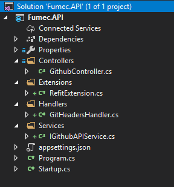

Para efetuar um teste, execute a aplicação e em seu navegadoe acesse o link **http://localhost:PORTA/api/github**. Se tudo ocorrer bem, será retornado um **Json** com todos os repositórios do seu usuário.

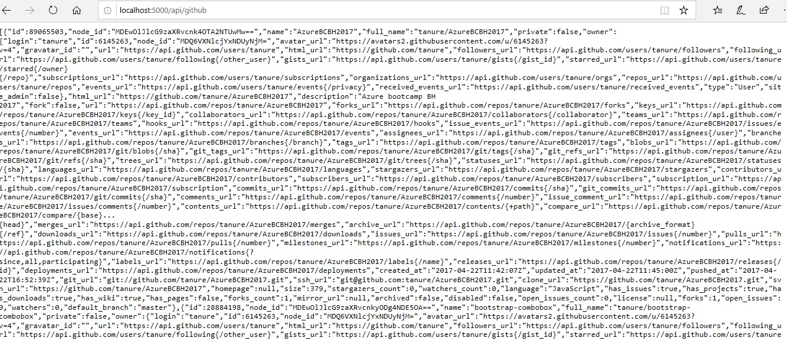

# Aplicação Mobile

Para criar a aplicação mobile, através do Visual Studio, clique em **File -> New Project**.

Na janela de projetos, pesquise por **Xamarin.Forms**, selecione a opção **Mobile App (Xamarin.Forms)** e clique em **Next**.


Configure os paràmetros do projeto:

- **Project Name**: Fumec.Mobile
- **Location**: Path desejado para a criação do projeto
- **Solution**: Create new solution
- **Solution name**: Fumec.Mobile

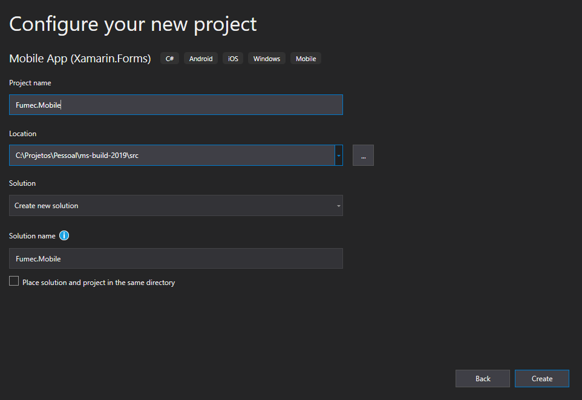

Clique em **Create**.

Na próxima tela, configure os parâmetros conforme a imagem abaixo e clique em **Ok**.

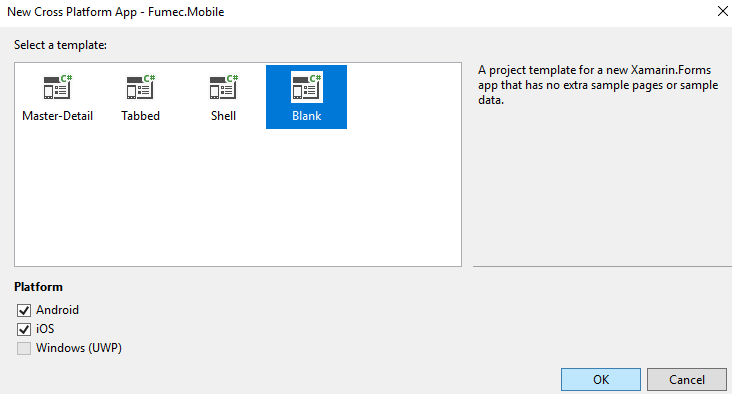

Após a criação do projeto mobile, a solution criada deve possuir 3 projetos, conforme a imagem abaixo:

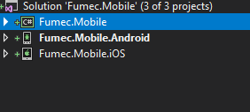

- **Fumec.Mobile**: Projeto Xamarin.Forms, comum aos projetos Android e IOS. Será neste projeto que criaremos a listagem de repositórios.
- **Fumec.Mobile.Android**: Projeto Android. Possui uma referência para o projeto **Fumec.Mobile**. Será compilado nativamente para o dispositivo em questão.
- **Fumec.Mobile.iOS**: Projeto iOS. Possui uma referência para o projeto **Fumec.Mobile**. Será compilado nativamente para o dispositivo em questão. Para usuários Windows, não será possível executar o projeto iOS a não ser que exista um Mac configurado na rede e conectado ao Visual Studio.


## Adicionando o pacote Nuget Refit

Conforme feito no projeto anterior, adicione a library **Refit** ao projeto **Fumec.Mobile**. 

Adicione também uma referência para **Newtonsoft.Json**.

## Arquivos do projeto mobile

O projeto criado já possui os principais arquivos necessários para a aplicação. O que será feito será a criação da infraestrutura para consumir a API criada anteriormente.

- Conforme demonstrado anteriormente, crie as seguintes pastas no projeto **Fumec.Mobile**:
    - ViewModel
    - Service
    - Model

Agora, serão adicionadas as classes para comunicação com a API e também os códigos de exibição dos dados.

- Model/Repository.cs

``` csharp

using Newtonsoft.Json;

namespace Fumec.Mobile.Model
{
    public class Repository
    {
        [JsonProperty("name")]
        public string Name { get; set; }

        [JsonProperty("full_name")]
        public string FullName { get; set; }

        [JsonProperty("url")]
        public string Url { get; set; }
    }
}


```

Esta classe de modelo irá representar 1 objeto de repositório, apenas com alguns atributos. Observe a anotação a cada propriedade, **JsonProperty**. se faz necessário para que a desserialização de Json -> Object possa ser feita com os valores corretos nas respectivas propriedades.

- Serivice/IFumecAPIService.cs

``` csharp

using Fumec.Mobile.Model;
using Refit;
using System.Collections.Generic;
using System.Threading.Tasks;

namespace Fumec.Mobile.Service
{
    public interface IFumecAPIService
    {
        [Get("api/github")]
        Task<List<Repository>> GetRepositories();
    }
}


```

Conforme o padrão utilizado no projeto da API, criamos uma interface que utiliza o padrão do REFIT para consumir um recurso via REST. O método **GetRepositories** irá consumir a lista de repositórios da API e irá Desserializar o Json em uma lista de objetos do tipo **Repository**, o model criado anteriormente.

- ViewModel/MainPageViewModel.cs

``` csharp

using Fumec.Mobile.Model;
using Fumec.Mobile.Service;
using Refit;
using System;
using System.Collections.ObjectModel;
using System.ComponentModel;
using System.Runtime.CompilerServices;
using System.Threading.Tasks;

namespace Fumec.Mobile.ViewModel
{
    public class MainPageViewModel : INotifyPropertyChanged
    {
        private IFumecAPIService _service;
        private bool _isBusy;
        public event PropertyChangedEventHandler PropertyChanged;

        public ObservableCollection<Repository> Repositories { get; }

        public bool IsBusy
        {
            get { return _isBusy; }
            set
            {
                SetValue(value, ref _isBusy);
            }

        }

        public MainPageViewModel()
        {
            Repositories = new ObservableCollection<Repository>();
            _service = RestService.For<IFumecAPIService>("http://"); // Criando uma instância a partir do REFIT para a interface IFumecAPIService
        }

        public async Task LoadAsync()
        {
            if (IsBusy) return;

            try
            {
                var repos = await _service.GetRepositories();

                foreach (var r in repos)
                    Repositories.Add(r);
            }
            catch(Exception ex)
            {

            }
            finally
            {
                IsBusy = false;
            }

        }

        protected void SetValue<T>(T value, ref T field, [CallerMemberName] string propertyName = "")
        {
            PropertyChanged?.Invoke(this, new PropertyChangedEventArgs(propertyName));
            field = value;
        }

    }
}


```